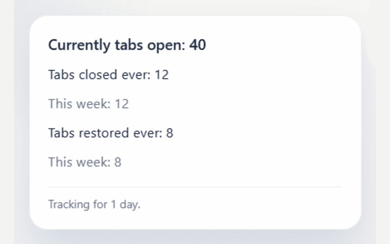

# Closed Tabs Stats 

Closed Tabs Stats is a simple Manifest V3 Chrome extension that records tab close and restore activity and shows a minimal text-only popup. The developer of this extension really likes (mostly useless) data.

## What it shows

- Currently open tabs
- Tabs closed ever
- Tabs closed last week with week-over-week change
- Tabs restored ever
- Tabs restored last week with week-over-week change

## Storage

All data is stored locally in `chrome.storage.local` inside your Chrome profile. Nothing is synced to Google or sent anywhere else.

## Important limitation

Chrome does not expose a perfect retroactive ledger for every tab restore action. Restore tracking here is best-effort using Chrome's recently closed session queue, which is enough for normal restore-shortcut and session-restore use.

## Install on chrome extension store

https://chromewebstore.google.com/detail/closed-tabs-stats/pabmedbgadohdmmdekmebopjjkkkbcjp

## Use it

Click the extension icon to open the popup and see the current metrics.
